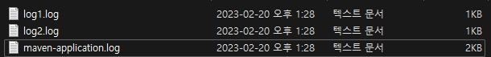

# 로그 설정 정리

# 1. 로깅 설정

이 글은 여러 자료들을 찾아보고 가장 나을 것 같다고 생각되는 것을 정리한 것이다. **Spring Boot 2.7.9 버전**을 기준으로 하며 **logback.xml** 을 설정한다.

먼저 로깅 처리에서 중요한 것 중 하나는 **Dev 와 Prod 환경의 차이를 두는 것이**다. 너무 많은 정보를 **Prod**에 넣어서는 안되고 필요한 정보를 **Dev**에 생략해서는 안된다.

그리고 중요한 것은 **log level** 별 로그를 작성하는 방법인데. 만약 사내 로그 스타일 가이드가 존재한다면 그것을 무조건 따라야 한다. 마음대로 스타일을 혼합하거나 규칙에 따르지 않으면 서로 간의 소통은 어려워지고 혼잡해진다.

**application.yml을 기준으로 한 logback.xml 등록 방법**

```yaml
logging:
  config: classpath:logback.xml
```

---

# 2. Log Level

Log Level이란, 로그를 나타내는 상태를 다섯 가지로 분류한다. 바로 **TRACE, DEBUG, INFO, WARN, ERROR** 이다. 그러면 각각 어떨 때 사용하면 될까?

- **TRACE** : 문제 상황을 추척하는 데 사용된다. 추적에 도움이 될 수 있도록 아주 자세히 적어야한다.
- **DEBUG** : debug 상황에서 출력되는 로그이다. 코드가 어떻게 돌아가는지에 대한 정보를 제공하자.
- **INFO** : 일반적인 정보나 애플리케이션 상태 또는 앤드포인트의 시작점을 알려도 좋다. 시작이나 끝을 출력하기도 한다.
- **WARN** : 잠재적인 위험이나 이슈를 출력한다. 하지만 에러의 상황은 아니다.
- **ERROR** : 심각한 문제나 에러가 발생했음을 알린다. 가능하면 많은 정보를 제공해야 한다.

그리고 에러 내용은 단순한 메시지를 작성하는 것보다 **구조적인 형태**로 작성하는 것이 좋다. 물론 이 말이 무조건 맞는 것이 아니고 규정이 있다면 사내 규정에 맞게 작성하자.

구조적인 형태란, **key-value** 로 표시하려는 의미를 간결하게 전달하는 것이다. **회원 아이디를 조회할 수 없을 때**의 예시를 살펴보자.

## **Ⅰ Not structured**

```java
ERROR ... **Failed to load user with userId : test1**
```

## **Ⅱ Be structured**

```java
ERROR ... **event=user_load_failure user_id=test1 error_message=Unable to find user with ID test1**
```

이 두개의 차이는 뭘까? 먼저 **구조적이지 않을 때(Not structured)**를 살펴보자. 해당 에러 상황에 대해 하나의 문장으로 간결하게 표시한다. 에러 메시지를 읽으면 그 의미를 알 수 있다. 단, 수백, 수만 개의 에러가 발생했을 때, 로그에서 메시지를 찾을 때, 어떤 키워드로 찾기를 해야할지 어렵다.

이와 반대로 **구조적일 때(Be structured)**는 각 상황별 event를 미리 약속해 놓고 ‘**user_load_failure**’를 조회하면 해당 이벤트의 에러 메시지들을 손쉽게 확인이 가능하다. 그리고 그 문제 원인과 값 또한 명시할 수 있다.

오히려 개발자에겐 한 눈에 들어오는 구조적인 형식이 나을 때가 많다.

---

# 3. 로그 생명주기

logback.xml 에 로그 파일을 분리할 때, 로그파일의 생명주기를 설정 할 수 있다. 먼저 다음의 예시를 살펴보자.

```xml
<appender name="LOG-FILE" class="ch.qos.logback.core.rolling.RollingFileAppender">
    <file>${LOG_ROOT}/${DEFAULT_LOG_FILE_NAME}.log</file>
    <encoder>
        <pattern>%d{HH:mm:ss.SSS} [%thread] %-5level %logger{36} - %msg%n</pattern>
    </encoder>
</appender>
```

**appender** 설정을 통해 로그 파일 위치와 파일 명을 설정하고 **encoder** 패턴을 정의했다.

이제 여기에 **최대 기간을 30일**로 설정하고(30일이 지나면 오래된 순서부터 삭제) **로그 파일당 최대 용량을 100MB, , 로그 파일 전체 용량 100GB**으로 설정해보자.

```xml
<appender name="LOG-FILE" class="ch.qos.logback.core.rolling.RollingFileAppender">
  <file>${LOG_ROOT}/${DEFAULT_LOG_FILE_NAME}.log</file>

    <!-- 이곳 -->
  **<rollingPolicy class="ch.qos.logback.core.rolling.SizeAndTimeBasedRollingPolicy">
      <fileNamePattern>${LOG_ROOT}/${DEFAULT_LOG_FILE_NAME}-%d{yyyy-MM-dd}.%i.log</fileNamePattern>
      <maxFileSize>10MB</maxFileSize>
      <maxHistory>30</maxHistory>
      <totalSizeCap>100GB</totalSizeCap>
  </rollingPolicy>**

  <encoder>
      <pattern>%d{HH:mm:ss.SSS} [%thread] %-5level %logger{36} - %msg%n</pattern>
  </encoder>
</appender>
```

각 속성 이름만 봐도 그 의미를 알 수 있을 것이다.

---

# 4. 로그 파일 분리

각 클래스별이나 패키지별로 로그 파일을 분리하고 싶을 수 있다. 예시로 보일 구조는 **com.mybatis.practice.log1** 과 **com.mybatis.practice.log1** 로 패키지로 구성 되어있다. 이제 이곳에서 나타난 로그들을 파일별로 따로 기록해보자.

## **Ⅰ property 설정(선택)**

각각의 파일 이름을 분리하기 위해 property를 설정하자.

```xml
<configuration>
    <property name="LOG_ROOT" value="D:\logs"/>
    <property name="LOG1_FILE_NAME" value="log1" />
    <property name="LOG2_FILE_NAME" value="log2" />
    <property name="DEFAULT_LOG_FILE_NAME" value="maven-application"/>

...
</configuration>
```

## **Ⅱ 로그 파일 설정**

property를 사용하여 로그 파일을 설정하자.

```xml
<!-- 로그1 파일 저장 설정 -->
<appender name="LOG1-FILE" class="ch.qos.logback.core.rolling.RollingFileAppender">
    <file>${LOG_ROOT}/${LOG1_FILE_NAME}.log</file>
    <rollingPolicy class="ch.qos.logback.core.rolling.SizeAndTimeBasedRollingPolicy">
        <fileNamePattern>${LOG_ROOT}/${LOG1_FILE_NAME}-%d{yyyy-MM-dd}.%i.log</fileNamePattern>
        <maxFileSize>10MB</maxFileSize>
        <maxHistory>30</maxHistory>
        <totalSizeCap>100GB</totalSizeCap>
    </rollingPolicy>
    <encoder>
        <pattern>%d{HH:mm:ss.SSS} [%thread] %-5level %logger{36} - %msg%n</pattern>
    </encoder>
</appender>

<logger name="com.mybatis.practice.log1" level="INFO" additivity="false">
    <appender-ref ref="LOG1-FILE"/>
</logger>

<!-- 로그2 파일 저장 설정  -->
<appender name="LOG2-FILE" class="ch.qos.logback.core.rolling.RollingFileAppender">
    <file>${LOG_ROOT}/${LOG2_FILE_NAME}.log</file>
    <rollingPolicy class="ch.qos.logback.core.rolling.SizeAndTimeBasedRollingPolicy">
        <fileNamePattern>${LOG_ROOT}/${LOG2_FILE_NAME}-%d{yyyy-MM-dd}.%i.log</fileNamePattern>
        <maxFileSize>10MB</maxFileSize>
        <maxHistory>30</maxHistory>
        <totalSizeCap>100GB</totalSizeCap>
    </rollingPolicy>
    <encoder>
        <pattern>%d{HH:mm:ss.SSS} [%thread] %-5level %logger{36} - %msg%n</pattern>
    </encoder>
</appender>

<logger name="com.mybatis.practice.log2" level="INFO" additivity="false">
    <appender-ref ref="LOG2-FILE"/>
</logger>
```

이제 애플리케이션을 실행해보면 정상적으로 로그파일이 생성되는 것을 확인할 수 있다.



---

# 5. json 형식으로 출력

로그 형식을 한 줄로 표현해도 좋지만 json 형식으로 아래와 같이 표현하고 싶을 때가 있다.

**출력**

```json
{
  "timestamp" : "2023-02-51 15:40:00.677",
  "logger_name" : "com.mybatis.practice.log1.Log1Controller",
  "thread_name" : "http-nio-33333-exec-1",
  "level" : "INFO",
  "error_message" : "Unable to find user with ID test1",
  "event" : "user_load_failure",
  "userId" : "test1",
  "caller_class_name" : "com.mybatis.practice.log1.Log1Controller",
  "caller_method_name" : "log1",
  "caller_file_name" : "Log1Controller.java",
  "caller_line_number" : 28
}
```

먼저 json 형식으로 넣는 방법부터 살펴보자.

## **Ⅰ JSON으로 넣기**

JSON으로 넣는 방법은 그렇게 어렵지 않다. 먼저 로그를 넣을 때, map 형식으로 넣어주면 된다.

```java
Map<String, String> logMessage = new HashMap<>();
logMessage.put("event", "user_load_failure");
logMessage.put("userId", "test1");
logMessage.put("error_message", "Unable to find user with ID test1");
log.info("{}",StructuredArguments.entries(logMessage));
```

## **Ⅱ 의존성 추가**

```xml
<dependency>
    <groupId>net.logstash.logback</groupId>
    <artifactId>logstash-logback-encoder</artifactId>
    <version>7.2</version>
</dependency>

<dependency>
    <groupId>ch.qos.logback</groupId>
    <artifactId>logback-classic</artifactId>
</dependency>
```

## **Ⅲ logback.xml 설정**

```xml
<!-- 로그1 파일 저장 설정 -->
<appender name="LOG1-FILE" class="ch.qos.logback.core.rolling.RollingFileAppender">
    <file>${LOG_ROOT}/${LOG1_FILE_NAME}.log</file>
    <rollingPolicy class="ch.qos.logback.core.rolling.SizeAndTimeBasedRollingPolicy">
        <fileNamePattern>${LOG_ROOT}/${LOG1_FILE_NAME}-%d{yyyy-MM-dd}.%i.log</fileNamePattern>
        <maxFileSize>10MB</maxFileSize>
        <maxHistory>30</maxHistory>
        <totalSizeCap>100GB</totalSizeCap>
    </rollingPolicy>

    <encoder class="net.logstash.logback.encoder.LogstashEncoder">
        <FieldNames>
            <message>[ignore]</message>    
            <levelValue>[ignore]</levelValue>
            <timestamp>timestamp</timestamp>
            <version>[ignore]</version>
        </FieldNames>
        <includeCallerData>true</includeCallerData>
        <jsonGeneratorDecorator class="net.logstash.logback.decorate.CompositeJsonGeneratorDecorator">
            <decorator class="net.logstash.logback.decorate.PrettyPrintingJsonGeneratorDecorator"/>
        </jsonGeneratorDecorator>
        <TimestampPattern>yyyy-MM-DD HH:mm:ss.SSS</TimestampPattern>
    </encoder>
</appender>
```

- **FieldNames** 는 json 형식으로 출력할 필드들의 **이름**을 설정한다.
  - **message** 안의 [ignore] 은 해당 필드를 제외시키라는 뜻이다.
  - **timestamp** 안에 timestamp를 한 이유는 아무것도 지정하지 않았을 시, @timestamp로 출력된다.
- **includeCallerData** : log를 저장한 클래스의 상세한 정보를 출력한다.
- **jsonGeneratorDecorator** : json 형식을 이쁘게 출력해준다.
- **TimestampPattern** : timestamp의 패턴을 정의한다.

커스텀하고 싶다면 아래의 클래스를 참고하자.

- `LogstashEncoder`
  
  ```java
  public class LogstashEncoder extends LoggingEventCompositeJsonEncoder {
      public LogstashEncoder() {
      }
  
      protected AbstractCompositeJsonFormatter<ILoggingEvent> createFormatter() {
          return new LogstashFormatter(this);
      }
  
      protected LogstashFormatter getFormatter() {
          return (LogstashFormatter)super.getFormatter();
      }
  
      public void addProvider(JsonProvider<ILoggingEvent> provider) {
          this.getFormatter().addProvider(provider);
      }
  
      public boolean isIncludeCallerData() {
          return this.getFormatter().isIncludeCallerData();
      }
  
      public void setIncludeCallerData(boolean includeCallerData) {
          this.getFormatter().setIncludeCallerData(includeCallerData);
      }
  
      public void setCustomFields(String customFields) {
          this.getFormatter().setCustomFieldsFromString(customFields);
      }
  
      public String getCustomFields() {
          return this.getFormatter().getCustomFieldsAsString();
      }
  
      public LogstashFieldNames getFieldNames() {
          return this.getFormatter().getFieldNames();
      }
  
      public void setFieldNames(LogstashFieldNames fieldNames) {
          this.getFormatter().setFieldNames(fieldNames);
      }
  
      public int getShortenedLoggerNameLength() {
          return this.getFormatter().getShortenedLoggerNameLength();
      }
  
      public void setShortenedLoggerNameLength(int length) {
          this.getFormatter().setShortenedLoggerNameLength(length);
      }
  
      public boolean isIncludeMdc() {
          return this.getFormatter().isIncludeMdc();
      }
  
      public void setIncludeMdc(boolean includeMdc) {
          this.getFormatter().setIncludeMdc(includeMdc);
      }
  
      public List<String> getIncludeMdcKeyNames() {
          return this.getFormatter().getIncludeMdcKeyNames();
      }
  
      public void addIncludeMdcKeyName(String includedMdcKeyName) {
          this.getFormatter().addIncludeMdcKeyName(includedMdcKeyName);
      }
  
      public void setIncludeMdcKeyNames(List<String> includeMdcKeyNames) {
          this.getFormatter().setIncludeMdcKeyNames(includeMdcKeyNames);
      }
  
      public List<String> getExcludeMdcKeyNames() {
          return this.getFormatter().getExcludeMdcKeyNames();
      }
  
      public void addExcludeMdcKeyName(String excludedMdcKeyName) {
          this.getFormatter().addExcludeMdcKeyName(excludedMdcKeyName);
      }
  
      public void setExcludeMdcKeyNames(List<String> excludeMdcKeyNames) {
          this.getFormatter().setExcludeMdcKeyNames(excludeMdcKeyNames);
      }
  
      public void addMdcKeyFieldName(String mdcKeyFieldName) {
          this.getFormatter().addMdcKeyFieldName(mdcKeyFieldName);
      }
  
      public boolean isIncludeTags() {
          return this.getFormatter().isIncludeTags();
      }
  
      public void setIncludeTags(boolean includeTags) {
          this.getFormatter().setIncludeTags(includeTags);
      }
  
      public boolean isIncludeContext() {
          return this.getFormatter().isIncludeContext();
      }
  
      public void setIncludeContext(boolean includeContext) {
          this.getFormatter().setIncludeContext(includeContext);
      }
  
      public boolean isIncludeStructuredArguments() {
          return this.getFormatter().isIncludeStructuredArguments();
      }
  
      public void setIncludeStructuredArguments(boolean includeStructuredArguments) {
          this.getFormatter().setIncludeStructuredArguments(includeStructuredArguments);
      }
  
      public boolean isIncludeNonStructuredArguments() {
          return this.getFormatter().isIncludeNonStructuredArguments();
      }
  
      public void setIncludeNonStructuredArguments(boolean includeNonStructuredArguments) {
          this.getFormatter().setIncludeNonStructuredArguments(includeNonStructuredArguments);
      }
  
      public String getNonStructuredArgumentsFieldPrefix() {
          return this.getFormatter().getNonStructuredArgumentsFieldPrefix();
      }
  
      public void setNonStructuredArgumentsFieldPrefix(String nonStructuredArgumentsFieldPrefix) {
          this.getFormatter().setNonStructuredArgumentsFieldPrefix(nonStructuredArgumentsFieldPrefix);
      }
  
      public ThrowableHandlingConverter getThrowableConverter() {
          return this.getFormatter().getThrowableConverter();
      }
  
      public void setThrowableConverter(ThrowableHandlingConverter throwableConverter) {
          this.getFormatter().setThrowableConverter(throwableConverter);
      }
  
      public String getTimeZone() {
          return this.getFormatter().getTimeZone();
      }
  
      public void setTimeZone(String timeZoneId) {
          this.getFormatter().setTimeZone(timeZoneId);
      }
  
      public String getTimestampPattern() {
          return this.getFormatter().getTimestampPattern();
      }
  
      public void setTimestampPattern(String pattern) {
          this.getFormatter().setTimestampPattern(pattern);
      }
  
      public String getVersion() {
          return this.getFormatter().getVersion();
      }
  
      public void setVersion(String version) {
          this.getFormatter().setVersion(version);
      }
  
      public boolean isWriteVersionAsInteger() {
          return this.getFormatter().isWriteVersionAsInteger();
      }
  
      public void setWriteVersionAsInteger(boolean writeVersionAsInteger) {
          this.getFormatter().setWriteVersionAsInteger(writeVersionAsInteger);
      }
  
      public String getMessageSplitRegex() {
          return this.getFormatter().getMessageSplitRegex();
      }
  
      public void setMessageSplitRegex(String messageSplitRegex) {
          this.getFormatter().setMessageSplitRegex(messageSplitRegex);
      }
  }
  ```
  

---

# 6. JPA 로깅 설정 Tip

JPA 도 logback.xml 을 통해서 설정할 수 있다. 하지만 여기선 application.yml 에서 설정하는 방법을 알아보겠다.

먼저 설정 값들의 종류이다. ( 더 많지만 생략)

```yaml
logging:
    level:
        spring:
            jpa:
                properties:
                    hibernate:
                        generate_statistics: true  // jpa 통계
                        session:
                            events:
                                log:
                                    LOG_QUERIES_SLOWER_THAN_MS: 3  // 3 MS 보다 오래걸리면 슬로우 쿼리 
        org:
            hibernate:
                SQL_SLOW: DEBUG     // 슬로우 쿼리 출력
                SQL: DEBUG          // SQL 출력
                cache: DEBUG         // 2차 캐시 상태 출력
                stat: DEBUG           // 모든 쿼리 분석 통계
                transaction: DEBUG     // 트랜잭션 정보
                type:
                    descriptor:
                            sql: TRACE         // 바인딩된 파라미터 값
```

**슬로우 쿼리**에 대한 설정은 **Prod**에서는 표시하면 안되고 **Dev** 환경에서도 **DEBUG** 수준으로 정의하는게 좋다.

또 `org.hibernate.type.descriptor.sql = TRACE` 로 설정하자. 그렇지 않으면 너무 많은 값이 출력되기 때문에 보기 어렵습니다.

## 1) Prod

**Prod** 환경은 위에서 말한 것처럼 가능한 성능을 위해 가능한 적은 정보를 출력하는게 좋다. 로그 수준을 **ERROR** 로 하여 필요한 부분만 나오게 한다.

```yaml
spring.jpa.properties.hibernate.generate_statistics=false
logging.level.org.hibernate=ERROR
```

- **spring.jpa.show-sql=true** 로 설정하는 경우가 있는데. 이는 Hibernate가 로깅 프레임워크를 사용하지 않고 표준 출력을 사용하여 SQL문을 출력하기 때문에 성능 저하가 있을 수 있다. 그러니 **false**로 설정하자 (default: false)

JPA를 사용할 경우, logback.xml 외에도 **application.yml**에서 설정할 수 있습니다. dev 환경에서는 DEBUG 레벨로 설정하며, prod 환경에서는 로그 레벨을 ERROR로 설정하는 것이 좋습니다. 또한, 슬로우 쿼리 출력에 대한 설정을 하는 경우, Prod에서는 출력하지 않는 것이 좋으며 Dev에서는 DEBUG 레벨로 설정하는 것이 좋습니다.

아래는 **Prod** 환경에서의 설정 예시입니다.

```yaml
spring:
  jpa:
    properties:
      hibernate:
        generate_statistics: false  # jpa 통계
  jackson:
    default-property-inclusion: non_null # null 값은 출력하지 않음
logging:
  level:
    org.springframework.web: WARN
    org.hibernate: ERROR
```

또한, 아래와 같은 설정을 추가하여 슬로우 쿼리를 출력하도록 설정할 수 있습니다.

```yaml
logging:
  level:
    org.hibernate.SQL: DEBUG
    org.hibernate.type.descriptor.sql: TRACE
```

이 설정은 Hibernate가 실행하는 SQL 쿼리를 DEBUG 레벨로 출력하고, 바인딩된 파라미터 값을 TRACE 레벨로 출력합니다.

## 2) Dev

Dev 환경에서는 아래와 같이 설정하는 것이 좋습니다.

```yaml
spring:
  jpa:
    properties:
      hibernate:
        generate_statistics: true  # jpa 통계
      properties:
        hibernate:
          # 3ms 이상 걸리는 쿼리를 슬로우 쿼리로 출력
          session:
            events:
              log:
                LOG_QUERIES_SLOWER_THAN_MS: 3
logging:
  level:
    org.springframework.web: DEBUG
    org.hibernate.SQL: DEBUG
    org.hibernate.type.descriptor.sql: TRACE
```

Dev 환경에서는 DEBUG 레벨로 출력하며, `spring.jpa.properties.hibernate.generate_statistics` 값을 `true`로 설정하여 JPA 통계를 수집합니다. 또한, 3ms 이상 걸리는 쿼리를 슬로우 쿼리로 출력하도록 설정합니다.JPA를 사용할 경우, logback.xml 외에도 application.yml에서 설정할 수 있습니다. dev 환경에서는 DEBUG 레벨로 설정하며, prod 환경에서는 로그 레벨을 ERROR로 설정하는 것이 좋습니다. 또한, 슬로우 쿼리 출력에 대한 설정을 하는 경우, Prod에서는 출력하지 않는 것이 좋으며 Dev에서는 DEBUG 레벨로 설정하는 것이 좋습니다.

아래는 Prod 환경에서의 설정 예시입니다.
